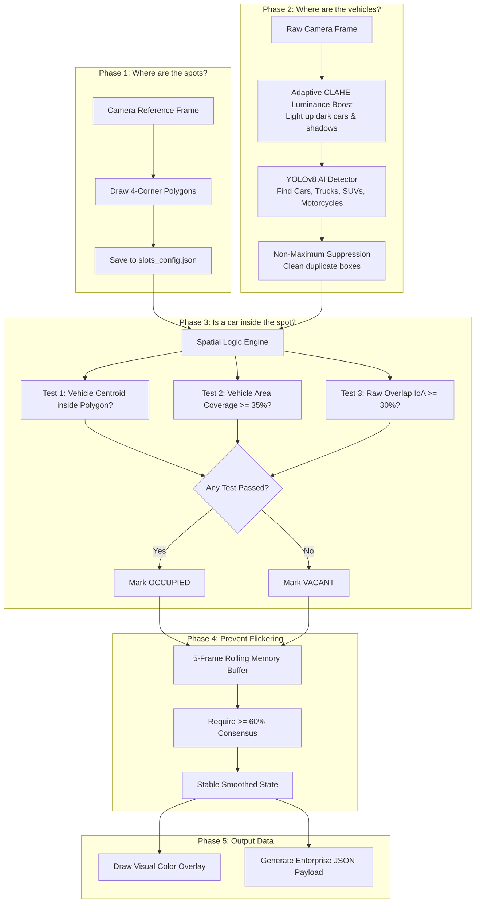

# Tab 6: Space Detection (CV) — The Complete Beginner's Guide

Welcome! This guide explains **Tab 6: Multi-Angle Parking Space Occupancy & Car Detection** in the Smart Parking System. Whether you are completely new to computer vision, AI, or software engineering, this document breaks down **how the system sees, thinks, and decides whether a parking space is empty (FREE) or filled (OCCUPIED)** using ordinary overhead CCTV security cameras.

---

## Table of Contents
1. [The Big Picture: What is Tab 6?](#1-the-big-picture-what-is-tab-6)
2. [Why is Parking Space Detection Hard?](#2-why-is-parking-space-detection-hard)
3. [How the System Works: The 5-Phase Algorithm](#3-how-the-system-works-the-5-phase-algorithm)
   - [Phase 1: Data Preparation & ROI Calibration (Where are the spots?)](#phase-1-data-preparation--roi-calibration)
   - [Phase 2: Vehicle Detection & Low-Light CLAHE Boost (Where are the cars?)](#phase-2-vehicle-detection--low-light-clahe-boost)
   - [Phase 3: Spatial Logic & Occupancy Decision (Is the car inside the spot?)](#phase-3-spatial-logic--occupancy-decision)
   - [Phase 4: Temporal Smoothing & Debouncing (Preventing Flickering)](#phase-4-temporal-smoothing--debouncing)
   - [Phase 5: Output Structuring & Live JSON Payload (Talking to other systems)](#phase-5-output-structuring--live-json-payload)
4. [Tour of the Tab 6 User Interface (UI)](#4-tour-of-the-tab-6-user-interface-ui)
   - [Top Control Toolbar](#top-control-toolbar)
   - [KPI Summary Cards](#kpi-summary-cards)
   - [Visual Feed Sub-Tabs](#visual-feed-sub-tabs)
   - [Slot-by-Slot Telemetry Table](#slot-by-slot-telemetry-table)
5. [How to Draw & Calibrate Your Own Polygons](#5-how-to-draw--calibrate-your-own-polygons)
6. [Troubleshooting: Why is a spot saying FREE when there's a car?](#6-troubleshooting)
7. [Glossary of Terms](#7-glossary-of-terms)

---

## 1. The Big Picture: What is Tab 6?

In modern smart parking garages, property managers often install expensive physical sensors in the ceiling above every single parking spot (ultrasonic or magnetic pucks). These cost thousands of dollars per bay to wire, maintain, and replace when they break.

**Tab 6 demonstrates an AI-powered software alternative:**
Instead of thousands of physical sensors, we use **existing overhead CCTV cameras**. A single camera can watch 6, 12, or 20+ parking bays at once. 

Our computer vision engine looks at the live video stream, finds where all the parking bays are painted on the concrete, detects any vehicles parked in the scene, and instantly updates the status of each bay to:
- **FREE (Vacant)** — The slot is clear and ready for a driver to park.
- **OCCUPIED** — A vehicle is parked inside the bay.

```
       Overhead CCTV Camera Feeds
                 │
                 ▼
 ┌────────────────────────────────────────┐
 │   Tab 6: 5-Phase Computer Vision Engine│
 │   1. Map Bay Polygons (ROI)            │
 │   2. Detect Cars/SUVs/Pickups (YOLOv8) │
 │   3. Compute Overlap & Centroid (IoA)  │
 │   4. Smooth Frames (Debouncer)         │
 │   5. Generate Live JSON Telemetry      │
 └────────────────────────────────────────┘
                 │
                 ▼
 ┌────────────────────────────────────────┐
 │  Live Dashboard Overlays,       │
 │  LED Entrance Signs & Driver App APIs  │
 └────────────────────────────────────────┘
```

---

## 2. Why is Parking Space Detection Hard?

To human eyes, looking at a photo and seeing if a car is in a spot is effortless. But for a computer (which only sees a giant grid of numbers representing red, green, and blue pixels), several challenges make this surprisingly difficult:

1. **Perspective Slant (Perspective Foreshortening):**
   CCTV cameras are mounted high up on walls or pillars. Real parking slots are rectangular, but through an angled lens, they look like **slanted trapezoids** (wider at the bottom of the picture, narrower at the top).
2. **Shadows & Low Lighting:**
   Basement parking decks are dim. Black cars, dark SUVs, and pickups blend directly into dark concrete floors and deep shadows, making them almost invisible to standard AI detectors.
3. **Occlusion (Tall Cars Blocking the View):**
   A tall SUV in the front row might have its roof projecting upward on the camera image, partially covering the parking space *behind* it even if that back space is completely empty.
4. **Moving Traffic vs. Parked Cars:**
   A car driving down the aisle past a vacant parking spot shouldn't cause the system to falsely report that the spot is occupied.

Our 5-phase engine solves every single one of these challenges!

---

## 3. How the System Works: The 5-Phase Algorithm

Here is a step-by-step breakdown of how the software processes every frame:



---

### Phase 1: Data Preparation & ROI Calibration
> *"Teaching the computer where the parking slots are on the ground."*

- **What is an ROI?** ROI stands for **Region of Interest**. It is simply a boundary drawn around a specific part of an image that we want the computer to pay attention to.
- **Why Polygons instead of Rectangles?** Because of the camera's angle, a parking space is not a flat upright rectangle on the screen. It is a 4-sided shape called a **trapezoid**.
- **How it works:** We take a clean picture of the parking lot when it's empty ([`car_dataset/empty lot.jpg`](file:///c:/Users/Tedd/Documents/College/2nd%20year/OJT/Megaworld/Personal%20Project/parking-poc/car_dataset/empty%20lot.jpg)) and trace the 4 corners of each painted bay (Top-Left, Top-Right, Bottom-Right, Bottom-Left).
- These $(X, Y)$ coordinates are saved in [`slots_config.json`](file:///c:/Users/Tedd/Documents/College/2nd%20year/OJT/Megaworld/Personal%20Project/parking-poc/slots_config.json).
- **Automatic Resolution Scaling:** If our reference image was $1372 \times 768$ pixels, but the live video feed arrives at $457 \times 192$ pixels, our engine automatically scales the polygon coordinates proportionally so the boundaries stay perfectly locked onto the concrete lines!

---

### Phase 2: Vehicle Detection & Low-Light CLAHE Boost
> *"Finding every car, truck, and SUV in the image."*

- **What is YOLOv8?** YOLO stands for *"You Only Look Once"*. It is an ultra-fast state-of-the-art deep neural network that scans an image in milliseconds and draws a yellow bounding box around objects it recognizes.
- **Filtering Vehicle Classes:** We instruct YOLO to only keep relevant vehicle categories:
  - Class 2: `Car` (Sedans, Hatchbacks, Coupes)
  - Class 3: `Motorcycle`
  - Class 5: `Bus`
  - Class 7: `Truck` (SUVs, Pickups, Vans)
- **The Low-Light CLAHE Boost:**
  - In dim parking decks, black cars often disappear into asphalt shadows.
  - To fix this, our pipeline converts the image into **CIELAB color space** and applies **CLAHE** (*Contrast Limited Adaptive Histogram Equalization*) to the $L$-channel (Luminance).
  - This mathematically brings out hidden grills, wheel arches, roof edges, and windshield borders without blinding or washing out bright white cars.
  - We run a **Dual-Exposure pass** (evaluating both the natural image and the contrast-boosted image) and merge the detections using **Non-Maximum Suppression (NMS)**.

---

### Phase 3: Spatial Logic & Occupancy Decision
> *"Doing the geometry: Is a car actually parked in this spot?"*

Once the computer knows **where the slots are (Phase 1 Polygons)** and **where the cars are (Phase 2 Boxes)**, it performs a geometry check.

We use **3 smart spatial tests**:

#### 1. Centroid Containment (The "Pin on the Map" Test)
We find the exact center point (centroid) of the car's bounding box $(c_x, c_y)$. If that center point is located inside the parking slot's polygon, the car is parked in that bay!

$$\text{If } (c_x, c_y) \in \text{Slot Polygon} \implies \text{OCCUPIED}$$

#### 2. Vehicle Coverage Ratio (The "Car in the Bay" Test)
Sometimes a driver parks slightly crooked. We calculate what percentage of the **car's body** is sitting inside the bay:

$$\text{Vehicle Coverage} = \frac{\text{Area}(\text{Slot Polygon} \cap \text{Car Box})}{\text{Area}(\text{Car Box})}$$

If **$\ge 35\%$** of the car is inside the bay polygon, it is marked as **OCCUPIED**.

#### 3. Intersection over Area (IoA) & Tire Ground-Contact
We calculate what fraction of the **slot area** is filled:

$$\text{IoA} = \frac{\text{Area}(\text{Slot Polygon} \cap \text{Car Box})}{\text{Area}(\text{Slot Polygon})}$$

If the car's bottom tire line touches the pavement inside the bay, it receives a ground-contact boost. If $\text{Effective IoA} \ge \tau_{\text{ioa}}$ (default $0.30$ or $30\%$), the bay is **OCCUPIED**; otherwise, it is **FREE**.

> **Quality Review Flag:** If a slot's score is right on the fence (within $\pm 5\%$ of the threshold), the engine marks it with a `low_confidence_flag = True` so human attendants can review it if needed.

---

### Phase 4: Temporal Smoothing & Debouncing
> *"Making sure the display doesn't flicker or panic."*

Imagine a pedestrian walking past a car, briefly blocking the camera's view of the vehicle's bumper for 1 frame. Or a passing headlight glare creating a temporary shadow.

If the AI reacted to every single microsecond frame, the screen would flicker rapidly between green and red.

**How we prevent this:**
- The engine keeps a rolling memory buffer of the last **5 frames** for each slot.
- A slot only changes state if at least **$60\%$ of recent frames (3 out of 5)** agree.
- This acts like a digital shock absorber, ensuring smooth, steady, and rock-solid indicators.

---

### Phase 5: Output Structuring & Live JSON Payload
> *"Exporting clean data for mobile apps and LED signs."*

Finally, the engine turns all the visual boxes into a clean, standardized **JSON (JavaScript Object Notation)** data package that any external system can consume via API:

```json
{
  "timestamp": "2026-08-19T04:15:00Z",
  "camera_feed": "image_12.png",
  "total_spaces": 6,
  "occupied_count": 6,
  "vacant_count": 0,
  "occupancy_rate": 1.0,
  "borderline_count": 0,
  "slots": [
    {
      "id": "F-01",
      "name": "Bay F-01",
      "zone": "Front Row",
      "status": "occupied",
      "occupancy_ratio": 0.765,
      "confidence": 0.781,
      "vehicle_class": "car",
      "low_confidence_flag": false
    },
    {
      "id": "F-02",
      "name": "Bay F-02",
      "zone": "Front Row",
      "status": "occupied",
      "occupancy_ratio": 0.830,
      "confidence": 0.859,
      "vehicle_class": "truck",
      "low_confidence_flag": false
    }
  ]
}
```

This JSON feed can be piped into:
- **Megaworld Township Mobile App** (showing drivers available bays before arrival)
-  **Electronic LED Entrance Display Boards** (`"LEVEL 2: 4 SPOTS AVAILABLE"`)
- **Billing & Security Database Records**

---

## 4. Tour of the Tab 6 User Interface (UI)

When you open **Tab 6** on the Streamlit dashboard ([http://localhost:8501](http://localhost:8501)), here is what every component does:

```
┌────────────────────────────────────────────────────────────────────────────────────────┐
│  [Select Camera Feed]  │  [YOLO Conf Slider]  │  [IoA Overlap Slider]  │  [Toggles]   │
├────────────────────────────────────────────────────────────────────────────────────────┤
│  [Total Spaces: 6]  │  [Vacant: 2]  │  [Occupied: 4]  │  [Rate: 66.7%]  │  [Vehs: 8]   │
├────────────────────────────────────────────────────────────────────────────────────────┤
│  [Tab: Annotated Overlay]  │  [Tab: Raw Feed]  │  [Tab: JSON Payload]       │
├────────────────────────────────────────────────────────────────────────────────────────┤
│  [Slot-by-Slot Telemetry Table]        │  [5-Phase Algorithm Architecture Card]        │
└────────────────────────────────────────────────────────────────────────────────────────┘
```

### Top Control Toolbar
1. **Select Surveillance Camera Feed / Perspective Angle:**
   Pick any test image or CCTV view (`empty lot.jpg`, `image_1.png` to `image_12.png`, or multi-level deck angles).
2. **YOLO Vehicle Conf ($\tau_{\text{conf}}$):**
   *Default: `0.25`*. Controls how sure the AI must be before it draws a box around a car. Lower values catch dark cars in dim light; higher values ignore faint shapes.
3. **IoA Overlap Ratio ($\tau_{\text{ioa}}$):**
   *Default: `0.30` (30%)*. Controls how much overlap is required to classify a spot as Occupied.
4. **Low-Light CLAHE Boost (Checkbox):**
   Enables adaptive luminance contrast enhancement to illuminate black SUVs, pickups, and heavy shadows.
5. **Temporal Smoothing (Checkbox):**
   Enables the 5-frame rolling memory window to eliminate state flickering.

### KPI Summary Cards
- **Total Spaces:** Number of calibrated parking bays monitored by this camera.
- **Vacant Slots:** Number of available spaces ready for drivers.
- **Occupied Slots:** Number of spaces currently filled by cars.
- **Occupancy Rate (%):** Lot fullness percentage ($\frac{\text{Occupied}}{\text{Total}}$).
- **Vehicles Tracked:** Total count of YOLO vehicle objects found in the camera view.

### Visual Feed Sub-Tabs
- **Annotated Vacancy Overlay:** Shows the live camera view with translucent **Emerald Green (Free)** and **Rose Red (Occupied)** polygons, labeled with slot IDs and occupancy percentages.
- **Raw Surveillance Feed:** Shows the unaltered original camera frame.
- **Phase 5 Standard JSON Payload:** Live interactive JSON viewer displaying the exact structured payload generated for downstream APIs.

### Slot-by-Slot Telemetry Table
A detailed table listing every individual bay:
- **Slot ID & Bay Name**
- **Zone** (`Front Row`, `Deck A`, etc.)
- **Status** (`Vacant` / `Occupied`)
- **IoA Overlap %** (How full the space is)
- **Confidence %** (AI certainty score)
- **Vehicle Class** (`car`, `truck`, `bus`, `—`)
- **Quality Flag** (`High Conf` vs `Borderline (±5%)`)

---

## 5. How to Draw & Calibrate Your Own Polygons

If you want to add a new camera or change how the parking slot polygons are drawn:

### Method A: Standalone Browser Calibrator (Easiest)
1. Double-click [`calibrate.html`](file:///c:/Users/Tedd/Documents/College/2nd%20year/OJT/Megaworld/Personal%20Project/parking-poc/calibrate.html) to open it in your web browser (Chrome or Edge).
2. Left-click the 4 corners of each parking bay on the image.
3. Press **`C`** on your keyboard (or click *Close Polygon*) to save the bay.
4. When finished, click **`Copy JSON to Clipboard`** and paste the result into [`slots_config.json`](file:///c:/Users/Tedd/Documents/College/2nd%20year/OJT/Megaworld/Personal%20Project/parking-poc/slots_config.json).

### Method B: OpenCV Desktop Tool
Run this command in your terminal:
```bash
python scripts/calibrate_roi.py --image "empty lot.jpg"
```
- Click corners $\rightarrow$ Press **`C`** to close $\rightarrow$ Press **`S`** to automatically save to [`slots_config.json`](file:///c:/Users/Tedd/Documents/College/2nd%20year/OJT/Megaworld/Personal%20Project/parking-poc/slots_config.json).

---

## 6. Troubleshooting: Why is a spot saying FREE when there's a car?

| What you see | Why it happens | How to fix it in 2 seconds |
|---|---|---|
| A car is clearly parked in a bay, but the badge says **`FREE`**. | The car is dark or in shadow, so YOLO's raw confidence was $0.22$, which is below the default slider threshold ($0.25$). | Slide the **YOLO Vehicle Conf ($\tau_{\text{conf}}$)** slider slightly to the left (e.g. `0.20`), or ensure **Low-Light Boost** is checked. |
| The badge says **`FREE`** right after changing images. | Temporal smoothing is waiting for consensus from previous frame history. | Uncheck **Temporal Smoothing** to see the instant single-frame result, or step through frames sequentially. |
| The car is parked very far forward, near the driving lane. | The car's centroid is outside the top half of the polygon. | Re-open [`calibrate.html`](file:///c:/Users/Tedd/Documents/College/2nd%20year/OJT/Megaworld/Personal%20Project/parking-poc/calibrate.html) and extend the bottom edge of the polygon closer to the aisle. |

---

## 7. Glossary of Terms

- **ROI (Region of Interest):** A customized boundary (polygon) drawn around a specific parking space.
- **IoA (Intersection over Area):** A math formula measuring what percentage of a parking spot polygon is overlapped by a detected vehicle box.
- **Centroid:** The exact geometric center $(x, y)$ of a vehicle's bounding box.
- **CLAHE (Contrast Limited Adaptive Histogram Equalization):** An advanced image filter that boosts contrast in dark areas without blowing out bright areas.
- **NMS (Non-Maximum Suppression):** An algorithm that removes duplicate overlapping bounding boxes for the same vehicle.
- **Debouncing:** Smoothing algorithm that requires consistent readings across multiple consecutive video frames before changing a slot's status.
- **JSON:** A lightweight, universal text format used to transmit structured data between servers, apps, and dashboards.

---

*Authored for the Megaworld Township Smart Parking POC — Proof of Concept & Educational Reference.*
